# XNOR ENGINE 

### A 3D game engine using OpenGL written in C++
#### The goal of the engine is to develop a FPS puzzle game

## Features

- Entity component
- Scene graph
- Content browser
- Entity inspector
- Physical Based Rendering
- Animation
- C# scripting
- Physics
- Shadows
- Hot reloading
- Audio

## Screenshots

### Alpha

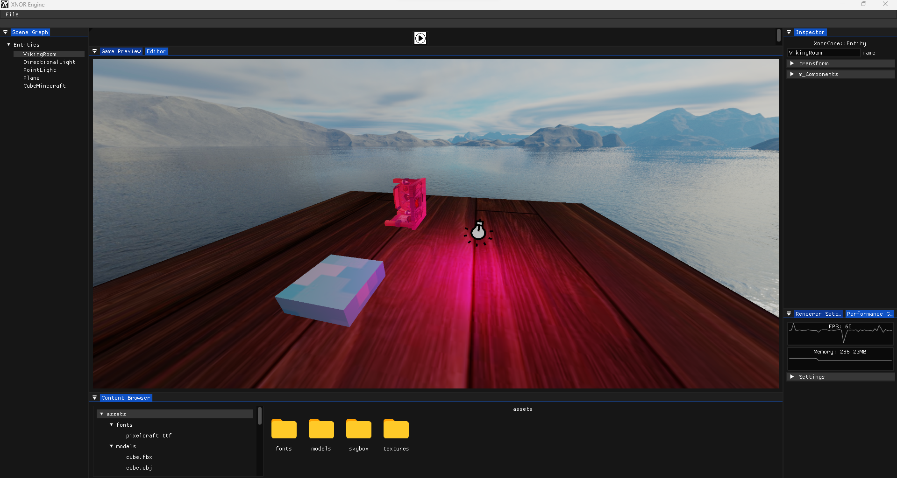

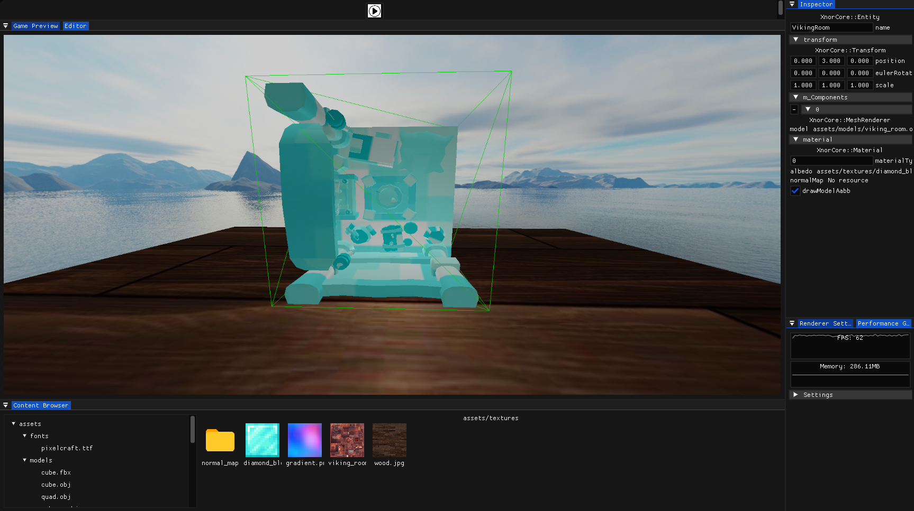

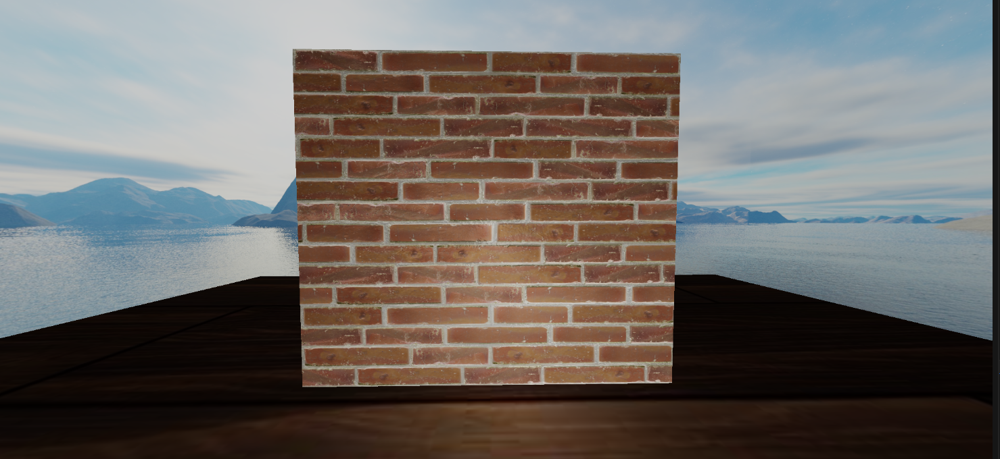

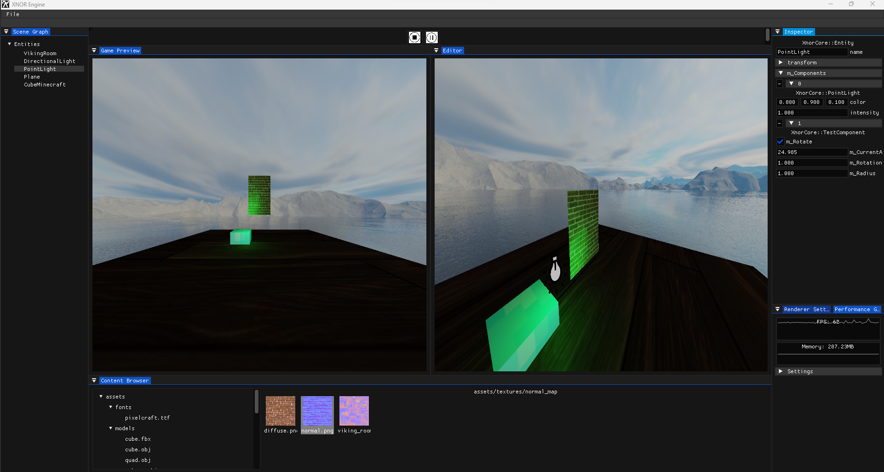

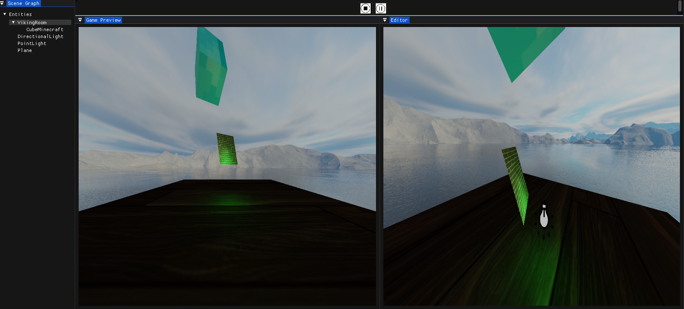

### Beta

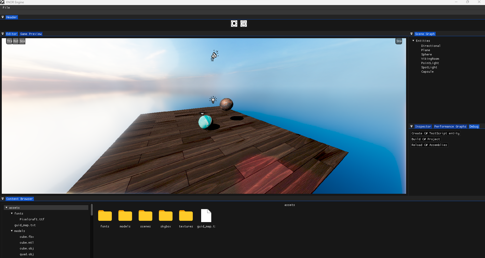

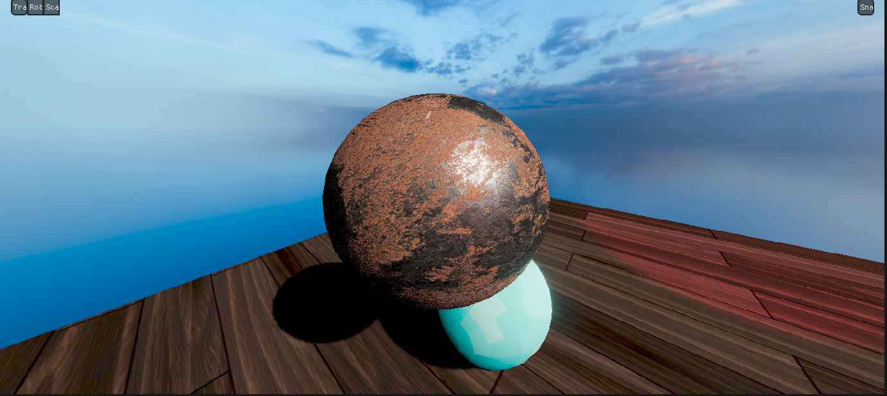

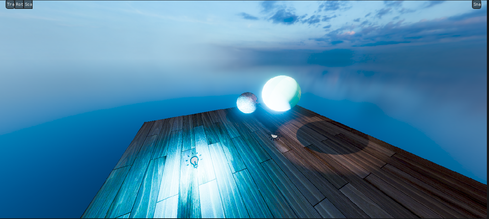

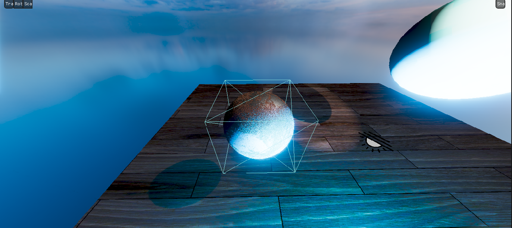

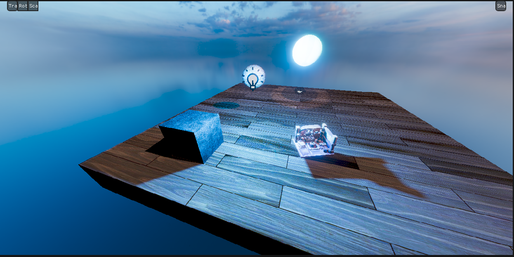

### Gold

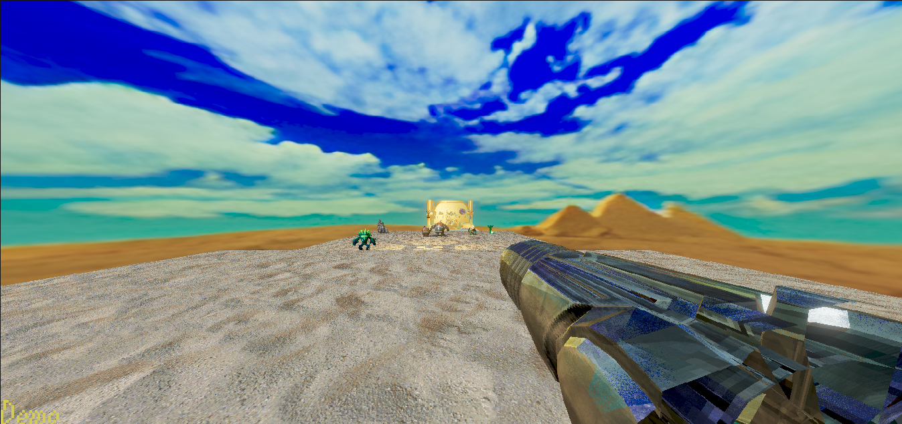

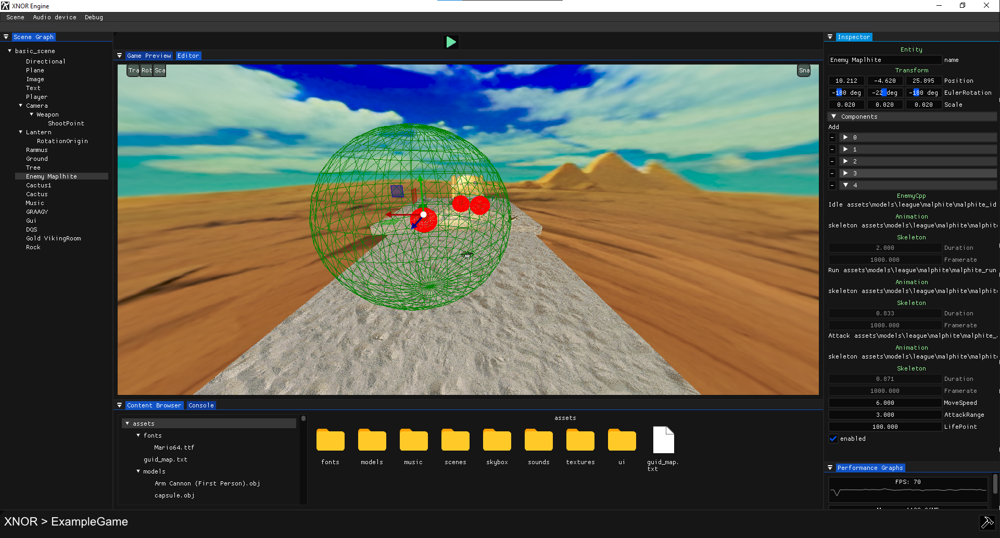

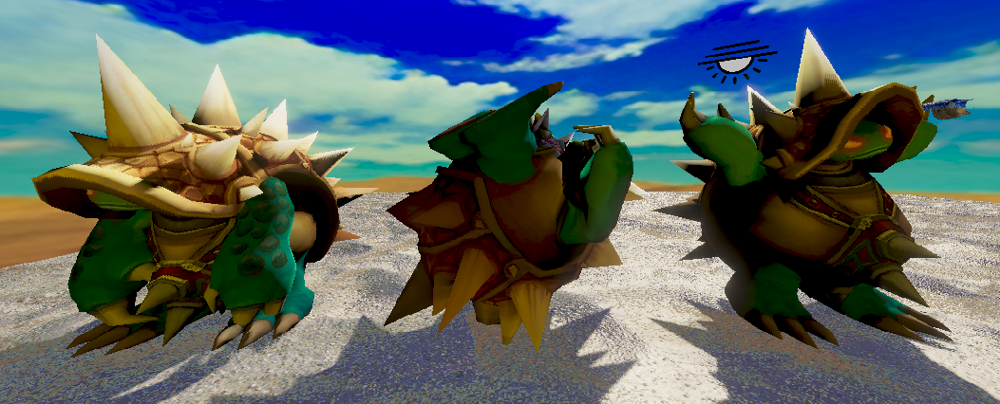

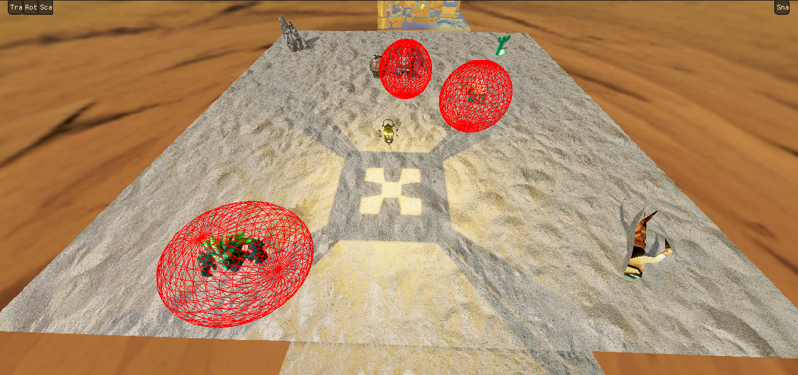

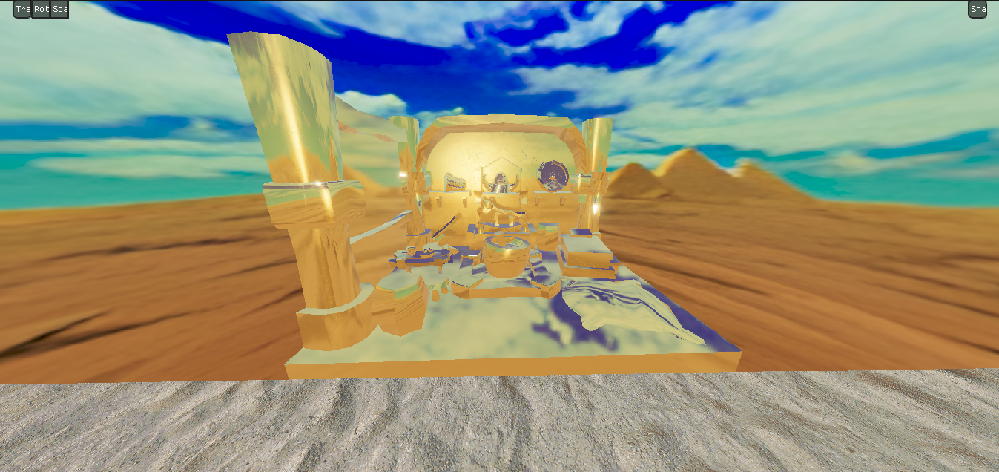

## External libraries

- Windowing : [Glfw](https://www.glfw.org/)
- UI : [ImGui](https://github.com/ocornut/imgui)
- Font loader : [ttf-parser](https://github.com/kv01/ttf-parser)
- Physics engine : [Jolt](https://github.com/jrouwe/JoltPhysics)
- Image loader : [StbImage](https://github.com/nothings/stb/blob/master/stb_image.h)
- Mp3 loader : [minimp3](https://github.com/lieff/minimp3)
- XML parser : [RapidXML](https://github.com/Fe-Bell/RapidXML)
- Audio API : [OpenAL](https://www.openal.org/)
- Model loader : [Assimp](https://github.com/assimp/assimp)
- DDS loader : [dds-image](https://github.com/spnda/dds_image)
- Reflection : [refl-cpp](https://github.com/veselink1/refl-cpp)
